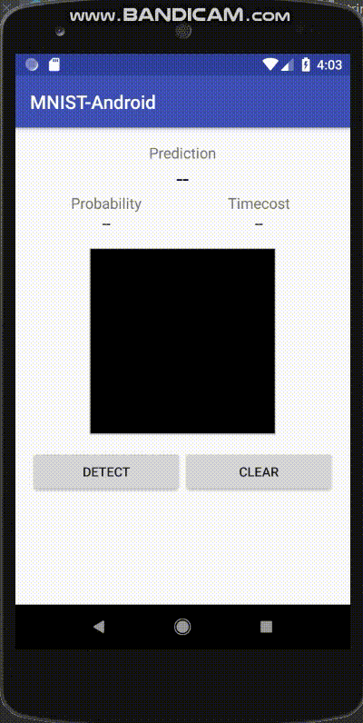

# Handwritten Digits Recognition

## Android Demo

<center></center>

## Description

The main purpose of this project is to understand and implement with TensorFlow Lite on Android.<br>
The data is MNIST which is a simple computer vision dataset, consisting of images of handwritten digits and labels. which is famous on Deep learning pattern recognition.<br>
The model i used is MLP(Multi layer perceptron) and CNN(Convolution neural networks) and etc

## Environment

- Window10
- Colab
- Python.3.6, Keras, TFLite
- Android Studio 3.0, Gradle 3.1.3

## Data set
- [MNIST](http://yann.lecun.com/exdb/mnist/)

## Project Structure

<br>
안드로이드 프로젝트의 디렉토리 구성은 다음과 같습니다.
```
$ App Name
.
├── manifest
│   └── AndroidManifest.xml
├── java
│   ├── Classifier
│   ├── MainActivity
│   └── Result
├── assets
│   └── mnist_mlp.tflite
├── res
│   ├── drawble   
│   ├── layout  
│   │   └── activity_main.xml
│   ├── mipmap
│   └── values
│       ├── colors.xml
│       ├── strings.xml
│       └── styles.xml
└── Gradle
    ├── build.gradle(Project:MNIST-Android)
    └── build.gradle(Module:app)
```
<br>
보다시피 디렉토리는 단순하게 구성되어 있습니다.<br>
훈련한 모델을 안드로이드에 올리고, 모델과 유저 인터페이스를 연결하면 끝입니다!  

1. 앞 서 만든 손글씨 숫자 분류 모델을 안드로이드에 올립니다.
  - `/android/app/src/main/assets`디렉토리에  mnist_mlp.tflite파일을 업로드합니다.<br>


소스코드는 분류 모델과 안드로이드를 연결하는 **Classifier** 클래스, 유저와 상호작용하는 **MainActivity**, 최종 결과를 반환하는 **Result** 클래스로 구성되어 있습니다. 좀 더 자세히 살펴볼까요? <p>

  2. **Classifier Class**
    - mnist_mlp.tflite파일을 읽어 Interpreter에 로드합니다. (Interpreter는 사전에 훈련 된 TensoFlow Lite 모델을 캡슐화합니다.)<p>
    - 사용자로 부터 입력받은 손 글씨 숫자 이미지를 회색 조(gray scale)로 바꾸는 전처리 과정이 포함되어있습니다.<p>

    ```java
      // Classifier Class 코드 일부
      public Result classify(Bitmap bitmap) {

        convertBitmapToByteBuffer(bitmap);

        long startTime = SystemClock.uptimeMillis();
        mInterpreter.run(mImgData, mResult);
        long endTime = SystemClock.uptimeMillis();
        long timeCost = endTime - startTime;

        return new Result(mResult[0], timeCost);
      }```
<br>
  - **Result Class**

    - Classifier class로 부터 받은 결과를 정의하는 클래스 입니다. <p>

  ```python
    public Result(float[] result, long timeCost) {
        mNumber = argmax(result);
        mProbability = result[mNumber];
        mTimeCost = timeCost;
  }```

    - `mNumber`는 제일 높은 확률 값을 가진 결과값을 나타냅니다. 즉, 어떤 숫자를 썻는지 맞추는 영역입니다.<p>
    - `mProbability`는 결과값의 확률을 나타냅니다.<p>
    - `mTimecost`는 입력 받은 손글씨로 부터 결과 값을 내기위한 실행 시간을 나타냅니다.(Inference Time)<p>
<br>

4. **MainActivity**

  ```java
  // 데이터 셋과 동일한 환경을 맞추기 위해 검은색 배경화면에 흰 글씨로 숫자를 적습니다.
  private void init() {
      Paint paint = new Paint();
      paint.setColor(Color.WHITE);
      paint.setStyle(Paint.Style.STROKE);
      paint.setStrokeWidth(20);
      mFpvPaint.setPen(paint);
      mFpvPaint.setBackgroundColor(Color.BLACK);
      mClassifier = new Classifier(this);
  }
  ```
  ```java
  // Detect 버튼
  @OnClick(R.id.btn_detect)
  void onDetectClick() {
        ...
        Bitmap image = mFpvPaint.exportToBitmap(Classifier.DIM_IMG_SIZE_WIDTH, Classifier.DIM_IMG_SIZE_HEIGHT);
        Result result = mClassifier.classify(image);
        renderResult(result);
    }
  // Clear 버튼
  @OnClick(R.id.btn_clear)
  void onClearClick() {
        mFpvPaint.clear();
        mTvPrediction.setText(R.string.empty);
        mTvProbability.setText(R.string.empty);
        mTvTimeCost.setText(R.string.empty);
  }
  ```

  - `Detect` 버튼을 클릭하면, 그린 손글씨 숫자 이미지가 Classifier에 의해 분류되고, 결과를 확인할 수 있습니다. <p>
  - `Clear` 버튼을 클릭하면, 다시 손글씨를 작성할 수 있는 새 도화지가 나타납니다.


## Reference

- Ryan Gotesman - [How to Bring Keras Models onto Android with ZERO Knowledge of Tensorflow](https://towardsdatascience.com/how-to-convert-from-keras-to-tflite-with-zero-knowledge-of-tensorflow-5448a296ae67)
- nex3z's Android demo : [tflite-mnist-android](https://github.com/nex3z/tflite-mnist-android/blob/master/README.md)
